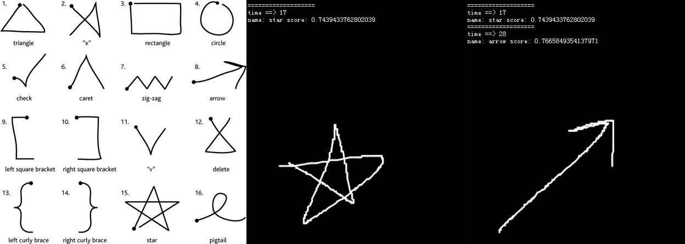

# UnistrokeRecognizer
单笔手写识别、手势识别

根据 <a>http://depts.washington.edu/aimgroup/proj/dollar/index.html</a> 修改版

此版本可以在 `Egret` 中直接使用。 



Demo 使用`Egret`，可以自定义手势。


```
//自定义手势添加
addGesture(name: string, points: Point[]): void;
/**
 * 识别
 * @param points
 * @param useProtractor true:用量角器（快）.false:黄金分割搜索
 * @returns {Result}
 * @constructor
 */
recognize(points: Point[], useProtractor: boolean): Result;
```

==>>顺便点颗星
